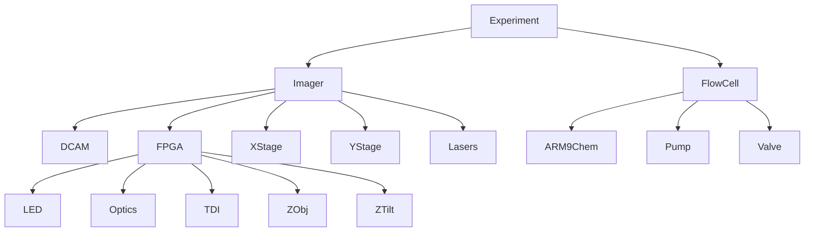

# PySeq2501

[](https://github.com/chaichontat/goff-rotation/actions/workflows/python-package-conda.yml)
[](https://github.com/psf/black)

**[Docs](https://chaichontat.github.io/pyseq2501/)**

Control your HiSeq 2000/2500 with ease.

**Web control (under development) available [here](https://github.com/chaichontat/pyseq2501-web).**

Fluidics control coming soon!

## Usage

Example scripts are in the [`scripts/`](scripts) folder. The showcase is `take_image.py`(scripts/take_image.py) which demonstrates fast image capture and autofocus.

Note that the actual capture of 12 bundles took less than a second.

This can be fast. Click on the image for a controllable animation! 

#### Overview
[](https://asciinema.org/a/GQXJvYMSXkKVMkfin9czNUk56?autoplay=1)

#### With debug info (all communications)
[](https://asciinema.org/a/s67mKomEwGj6l7azkx0PCboeO?autoplay=1)


## Architecture
The scientific logic are in `Experiment`, `FlowCell`, and `Imager`. `Experiment` coordinates `FlowCell` and `Imager`. `Imager` and `FlowCell` communicates high-level commands to each instrument class, which then sends the actual command to each instrument.


## Installation
This package is written for Python 3.10+ and requires Windows 10 to function. For those using Windows 7, you can perform a [dual-boot](https://www.techadvisor.com/how-to/windows/how-dual-boot-windows-3633084/) installation on any other partitions relatively easily.

The only required custom driver is the Illumina/ActiveSilicon [driver](https://github.com/chaichontat/pyseq2501/tree/main/driver) which functions in both Windows 7 and Windows 10.

Using conda,
```bash
conda env create -n pyseq -f environment.yml
pip install -e .
```

