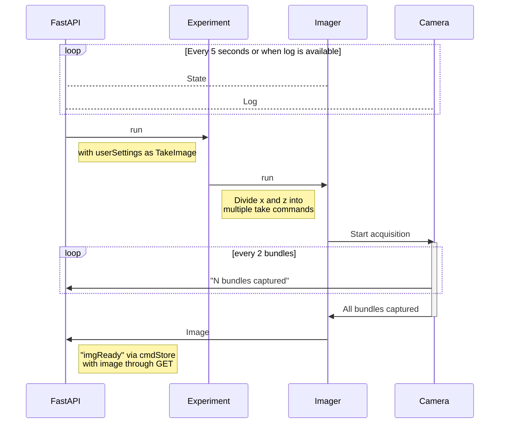

# PySeq 2501 Web Interface

[](https://chaichontat.github.io/pyseq2501-web/)

This is the web interface and the communication system for [PySeq 2501](https://github.com/chaichontat/pyseq2501). Click on the badge above to see an example site!

## Usage


## Installation
Install [`npm`](https://docs.npmjs.com/downloading-and-installing-node-js-and-npm) and clone this repo.

Run
```sh
npm i
npm run build
npm run preview
```

## Sequence


