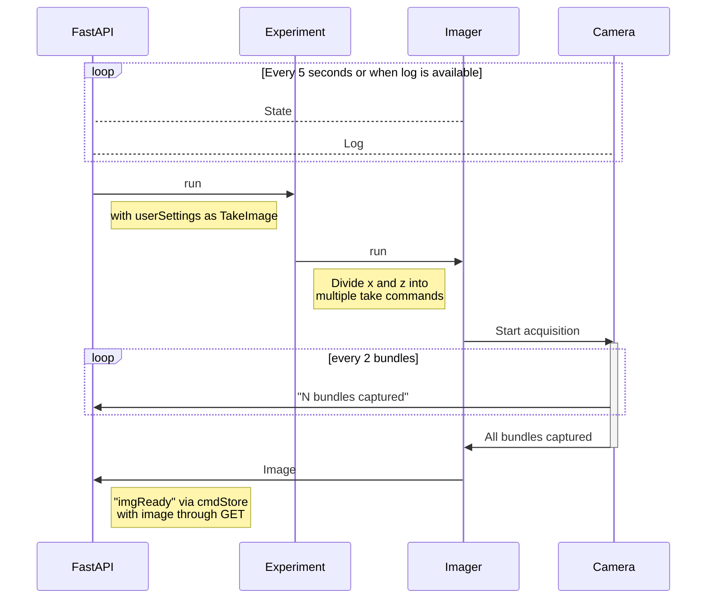

# PySeq 2501 Web Interface

[](https://chaichontat.github.io/pyseq2501-web/)

This is the web interface and the communication system for [PySeq 2501](https://github.com/chaichontat/pyseq2501). Click on the badge above to see an example site!

## Usage


## Installation
- Install [`pyseq2501`](https://github.com/chaichontat/pyseq2501)
    ```sh
    git clone https://github.com/chaichontat/pyseq2501
    conda env create -n pyseq -f environment.yml
    conda activate pyseq
    pip install pyseq2501/.
    ```


- Install [`npm`](https://docs.npmjs.com/downloading-and-installing-node-js-and-npm).
- Clone this repo and run. The first command updates the `pyseq` environment.
    ```sh
    git clone https://github.com/chaichontat/pyseq2501-web
    cd pyseq2501-web
    conda env update -n pyseq -f environment.yml
    pip install .
    npm i
    npm run build
    ```

A [`tox`](https://tox.wiki/en/latest/) environment is available to make sure everything works.

## Run
```sh
pyseq2server --fake
```

```
Usage: pyseq2server [OPTIONS]

Options:
  -p, --port INTEGER  Port to run the server on (default: 8000).
  -h, --host TEXT     Hostname to bind to (default: localhost). Set 0.0.0.0
                      for network access.
  -o, --open          Open a web browser
  --fake              Use fake machine interface.
  --donothost         Only host the websocket, not the interface. Useful when
                      developing Svelte.
  --help              Show this message and exit.
```

The interface should be waiting for you at `http://localhost:8000/`!

## Sequence


