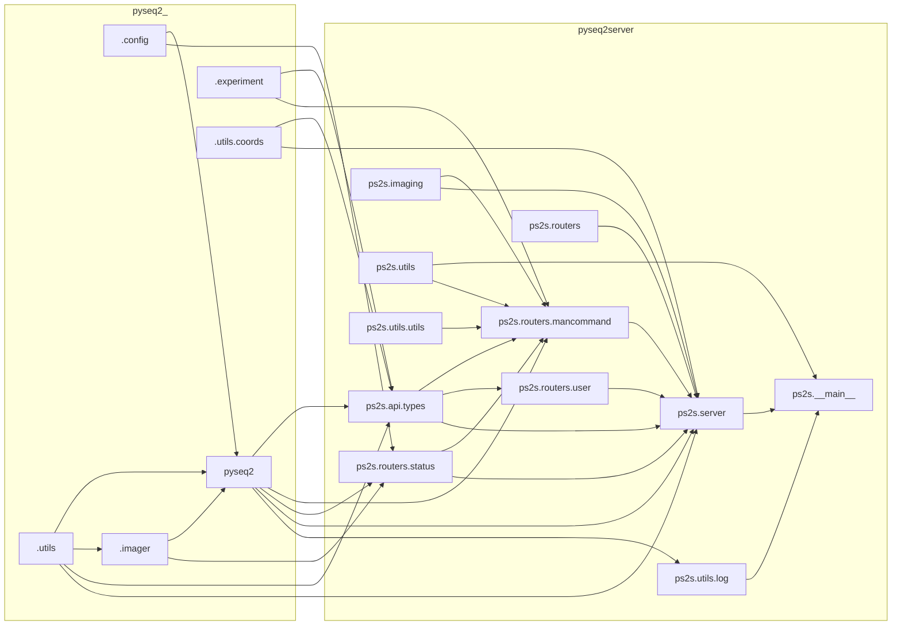

# PySeq 2501 Web Interface

[](https://chaichontat.github.io/pyseq2501-web/)

This is the web interface and the communication system for [PySeq 2501](https://github.com/chaichontat/pyseq2501). Click on the badge above to see an example site!

## Usage


## Installation

<!-- ```sh
pip install git+https://github.com/chaichontat/pyseq2501-web
``` -->

### For development

- Install [`npm`](https://docs.npmjs.com/downloading-and-installing-node-js-and-npm).
- Install [`poetry`](https://python-poetry.org/docs/).
  - If you have a `conda` environment, you can create a new environment with `python=3.10 poetry` as dependencies.
  ```sh
  conda create -n {NAME REPLACE THIS} python=3.10 poetry
  ```

Then,

```sh
git clone https://github.com/chaichontat/pyseq2501-web
cd pyseq2501-web
poetry install
npm i
npm run build
```

A [`tox`](https://tox.wiki/en/latest/) environment is available to make sure everything works.

## Run

```sh
pyseq2server --fake
```

```
Usage: pyseq2server [OPTIONS]

Options:
  -p, --port INTEGER  Port to run the server on (default: 8000).
  -h, --host TEXT     Hostname to bind to (default: localhost). Set 0.0.0.0
                      for network access.
  -o, --open          Open a web browser
  --fake              Use fake machine interface.
  --donothost         Only host the websocket, not the interface. Useful when
                      developing Svelte.
  --help              Show this message and exit.
```

The interface should be waiting for you at `http://localhost:8000/`!

## Dependencies



## Sequence


